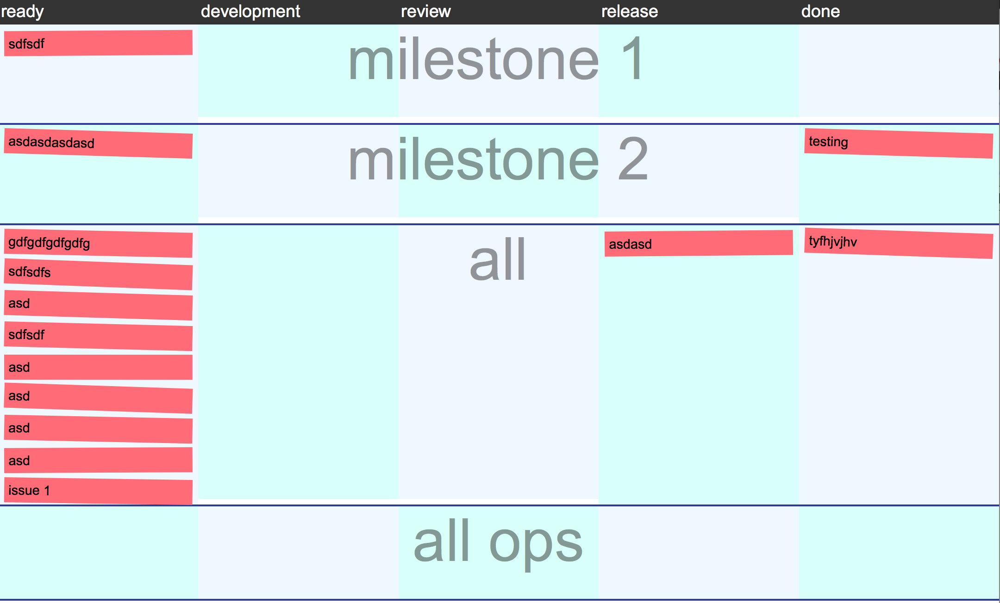

icanhazissues
=============

Teh kanban. Full of kitteh.



icanhasissues adds a kanban view to any github issues repo. We use it to
triage and do scrumm-like activities.

Deploy
------

Setup:
```
cat ~/.ssh/id_rsa.pub | ssh office1.pusher.com "sudo sshcommand acl-add dokku
YOUR_USER"
git remote add office dokku@office1.pusher.com:issuesplz
```

Deploy:
```
git push office master
```
